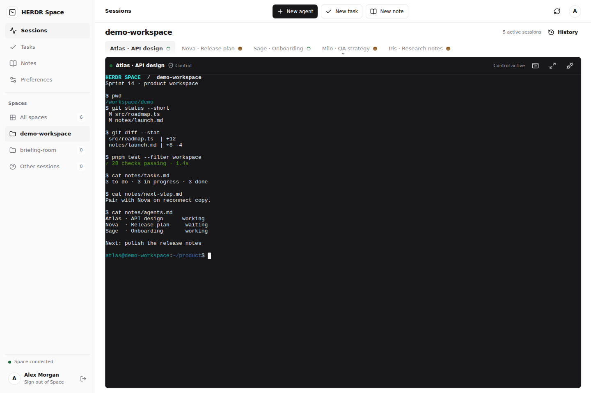
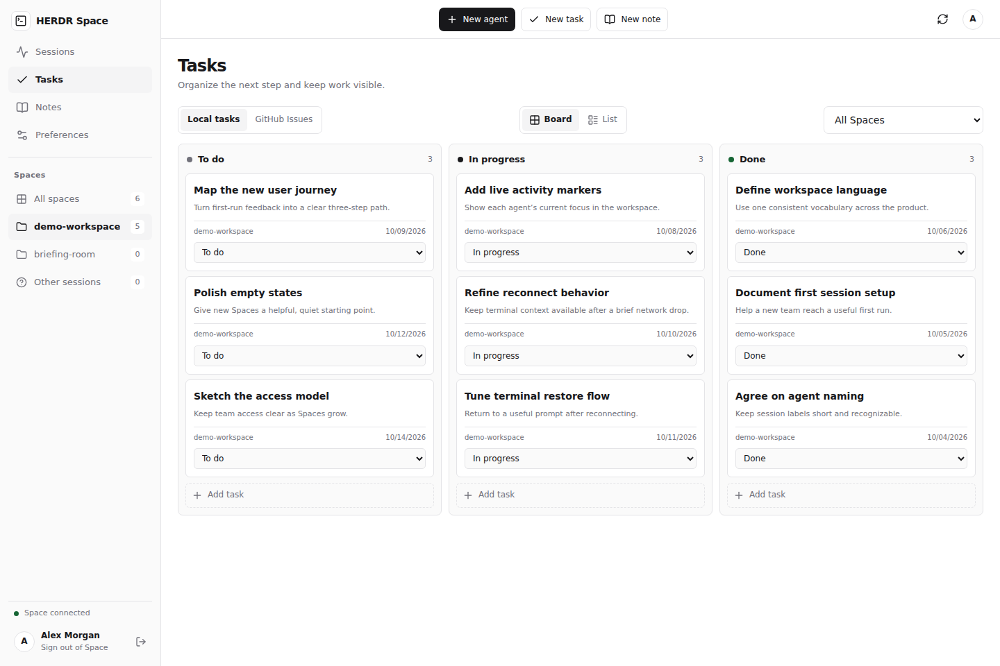
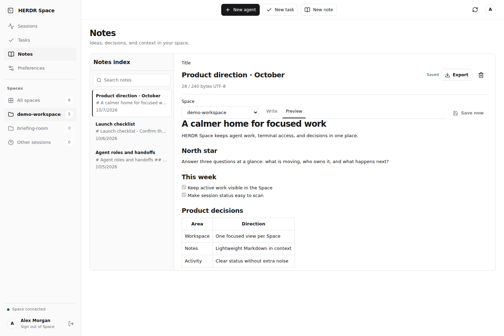
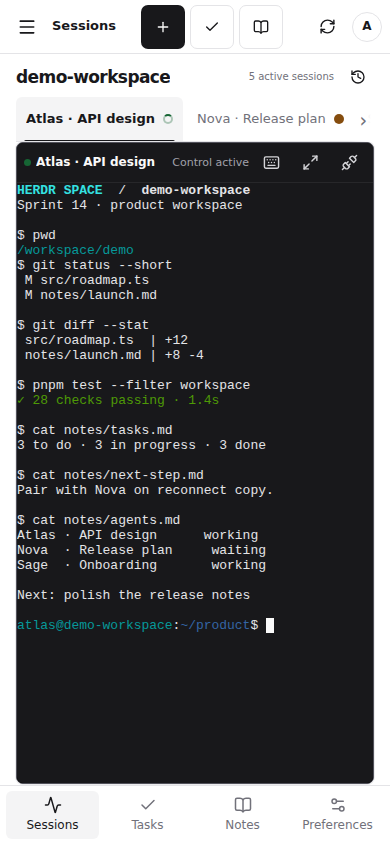

<div align="center">

# HERDR Space

### Your AI agents. One calm workspace.

Spaces, live terminals, tasks, GitHub issues, and Markdown notes.<br>
Self-hosted. Open source. Built around [HERDR](https://github.com/herdrdev/herdr).

[](https://github.com/calneymgp/herdr-space/actions/workflows/verify.yml)
[](LICENSE)
[](https://github.com/calneymgp/herdr-space/stargazers)
[](https://github.com/calneymgp/herdr-space/forks)
[](https://github.com/calneymgp/herdr-space/commits/main/)


[Get started](#get-started) · [Screenshots](#screenshots) · [Host it](#host-it) · [Documentation](#documentation)

</div>



> Screenshots use an isolated demo environment with fictional spaces, sessions, tasks, and notes.

## ✨ A workspace that stays out of your way

| | What you get |
| --- | --- |
| 🗂️ **Spaces first** | Repositories in the sidebar. Named session tabs. Open a space and get straight to its active agents. |
| 💻 **Live terminals** | Real terminal interaction through xterm.js, with explicit observation and keyboard control. |
| ⚡ **Fast switching** | Keep the three most recently visited terminal views in browser memory and reconnect when you return. |
| ✅ **Tasks & issues** | A simple kanban for local tasks, plus GitHub issue creation and updates through the server's existing GitHub CLI authentication. |
| 📝 **Markdown notes** | Capture ideas, write project notes, and preview Markdown without adding another app. |
| 📱 **Desktop & mobile** | The same workspace in your desktop browser or on your phone. |
| 🔐 **Two-factor sign-in** | One owner account, password plus TOTP, and a persistent seven-day browser session. |

A Go API, a local SQLite database, and a React client embedded in the executable. HERDR Space runs alongside your HERDR CLI on the same server.

<a id="screenshots"></a>

## 📸 Screenshots

Click an image to open it at full size. All content below is mock data.

| ✅ Tasks | 📝 Notes |
| --- | --- |
| [](docs/screenshots/tasks-desktop.png) | [](docs/screenshots/notes-desktop.png) |

<details>
<summary><strong>📱 See the mobile workspace</strong></summary>
<br>

<a href="docs/screenshots/workspace-mobile.png"></a>

</details>

<a id="get-started"></a>

## 🚀 Get started

The server needs **Linux** and `/proc` to discover local processes. The browser client works on desktop and mobile operating systems. HERDR itself is a separate Apache-2.0 project and is not included; this release was tested with HERDR 0.9.3.

Install Node.js 24, Go 1.27.1, and an existing HERDR installation on a Linux host. A [verified project-local Go installer](scripts/install-toolchain.py) is available with `make toolchain`; otherwise a compatible `go` on `PATH` works. From a fresh clone:

```sh
git clone https://github.com/calneymgp/herdr-space.git
cd herdr-space
make deps
make build
./bin/herdr-space auth setup --data-dir .state/dev
make dev
```

`auth setup` requires an interactive terminal. Choose a username and a password of at least 16 characters, enter the current six-digit TOTP code, and store the one-time recovery codes securely. The secret and codes appear only on that terminal. Open `http://127.0.0.1:9380` and sign in with the next TOTP code. `make dev` binds to loopback and explicitly enables local HTTP; never use that flag on a public listener.

The account's data and encryption key live in the chosen data directory. Keep the directory private and back it up. Run `./bin/herdr-space auth change` to rotate credentials or `./bin/herdr-space auth recovery` to regenerate codes, with the same `--data-dir` as the server. Use `make verify` for Go race tests, frontend tests, vet, and an embedded build.

<a id="host-it"></a>

## 🌐 Host it

Serve behind an HTTPS reverse proxy and pass the exact external origin to `--origin`, such as `https://space.example.com`. The server refuses an absent origin and remote HTTP. Bind the app to loopback or another private interface; configure the proxy's TLS and access controls for your environment. The [operations guide](docs/OPERATIONS.md) includes example user services, backups, and optional Cloudflare Access browser enrollment. Initial owner creation through `auth setup` is the portable default.

<a id="documentation"></a>

## 🧭 Documentation

| Guide | Start here when you want to… |
| --- | --- |
| [Architecture](docs/ARCHITECTURE.md) | Understand how spaces, sessions, terminals, and storage fit together. |
| [Operations](docs/OPERATIONS.md) | Install, host, back up, or configure optional Cloudflare Access. |
| [API contract](docs/CONTRACT.md) | Work with the HTTP and WebSocket APIs. |
| [Security](docs/SECURITY.md) | Understand authentication and terminal access protections. |
| [Browser tests](tests/browser/README.md) | Run the synthetic Chromium and WebKit checks. |
| [Contributing](CONTRIBUTING.md) | Build locally and contribute a change. |
| [Report a vulnerability](SECURITY.md) | Report a security issue privately. |

## 🧪 Verification

The [GitHub Actions workflow](https://github.com/calneymgp/herdr-space/actions/workflows/verify.yml) checks Go race tests, vet, frontend tests, and the embedded build, followed by real Chromium and WebKit scenarios for sign-in, terminals, session caching, and service-worker migration. The badges above show live CI and GitHub activity.

## 🤝 Free to use, open to contributions

HERDR Space is free software under the [MIT license](LICENSE). Redistributions of the binary or web assets must include [the dependency license bundle](third_party/THIRD_PARTY_LICENSES.md).

Found something to improve? [Open an issue](https://github.com/calneymgp/herdr-space/issues) or read the [contribution guide](CONTRIBUTING.md). If the project is useful to you, a ⭐ helps others find it.
